# School District Analysis

## Overview 

The following is an analysis of a school district's standardized test scores to provide insights into performance trends and patterns in relation to school spending, school size, and school type. After scores belonging to the Thomas High School ninth grade were found to show evidence of academic dishonesty, the analysis was undertaken a second time with those scores affected being voided. The differences between the original analysis and the second excluding ninth grade scores from Thomas High School are discussed below. 

## Results

* On a district level, the omission of Thomas High ninth grade scores lowers four of the five standardized testing performance measures with exception being the average reading score, which stayed roughly the same.
  ##### Original District Summary
  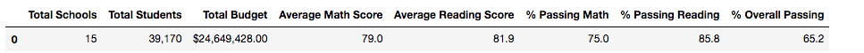
  ##### Revised District Summary
  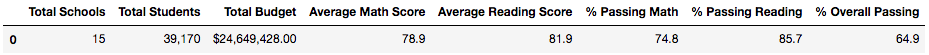

* In a school by school analysis, only the scores of Thomas High School are affected in the revised analysis. As shown below, all performance metrics with the exception of average reading score, which increased minutely, fell slightly when the scores in question were eliminated.
  ##### Thomas High School Summary
  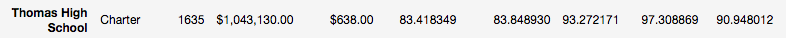
  ##### Revised Thomas High School Summary
  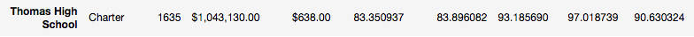
  
  The complete revised district summary by school is shown below:
  ##### Revised Disctrict Summary by School
  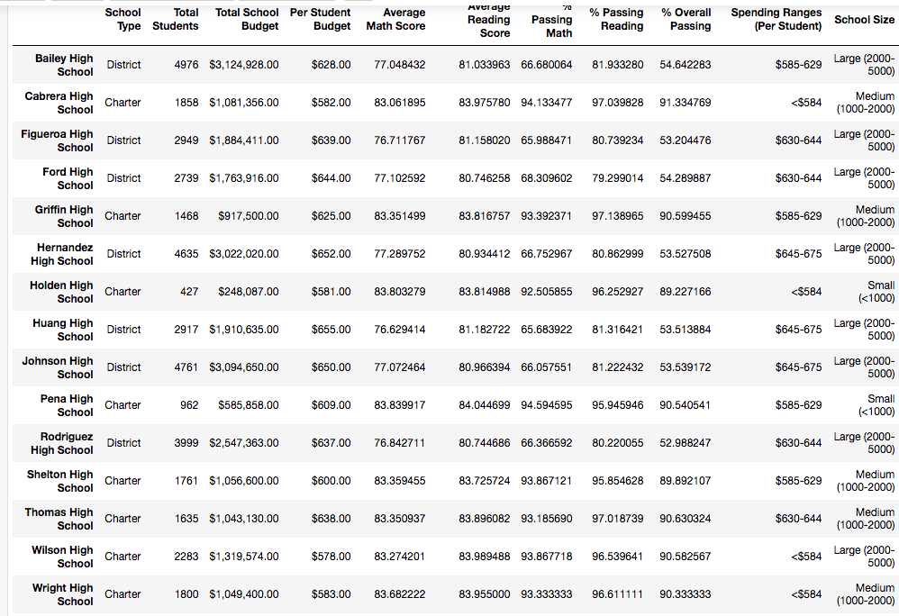

* In both analyses, Thomas High School was within the top five highest performing schools and was second when ranked by overall percentage of students passing both math and reading. When it comes to the other metrics, Thomas High fell from having the second highest to third highest average math scores, third highest to fourth higest average reading score, and highest to third highest percentage of students passing reading.    
  ##### Top 5 Schools
  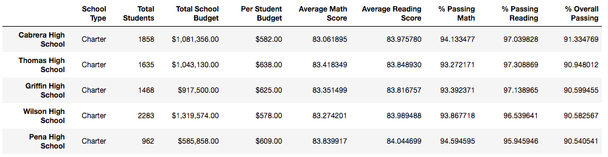
  ##### Revised Top 5 Schools
  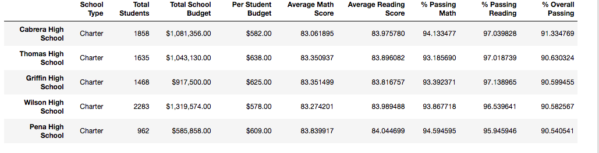

* When math and reading averages were analyzed by grade, ninth grade scores at Thomas High School were replaced by the word "nan" for "Not a Number". The rest of the results were unaffected between the two analyses. 
  ##### Revised Math Scores by Grade
  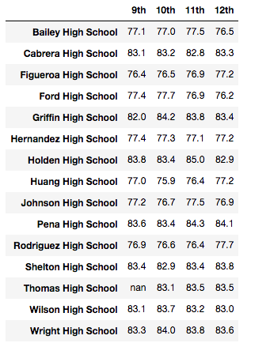
  ##### Revised Reading Scores by Grade
  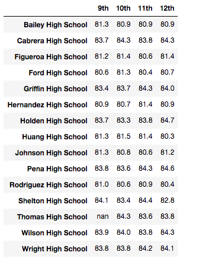

* Standardized testing performance when analyzed by school spending did not significantly change when ninth grade scores from Thomas High School were omitted. The results of the revised analysis is pictured below. 
  ##### Revised Performance by School Spending
  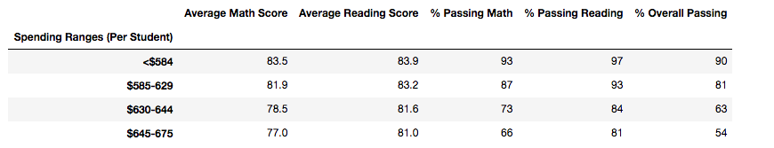

* Standardized testing performance when analyzed by school size did not significantly change when ninth grade scores from Thomas High School were omitted. The results of the revised analysis is pictured below. 
  ##### Revised Performance by School Size
  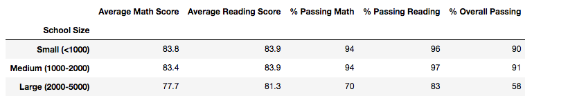

* Standardized testing performance when analyzed by school type (charter or district) did not significantly change when ninth grade scores from Thomas High School were omitted. The results of the revised analysis is pictured below.
  ##### Revised Performance by School Type
  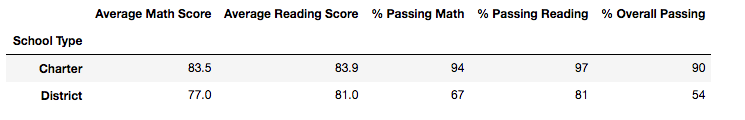

## Summary:

Overall, it can be said that the replacement of the Thomas High School ninth grade scores with NaN had a relatively small effect on the overall analysis, especially when standardized testing performanced was analyzed as a function of school spending, school size, and school type. Using a resolution of a tenth of a point for average math and reading scores, and whole numbers for percentages, nullifying the ninth grade scores indeed did not change the results of the analysis. On a district level, however, the nullification of the scores resulted in a slight lowering of average math scores, percentage of students passing math, percentage of students passing reading, and students passing both math and reading, % overall passing. Average reading score remained essentially the same. This may be seen as support for the claim that the ninth grade scores were artificially high, though it should also be noted that the affected performance measures only dropped minutely: 0.1 point for the average math score and 0.1 - 0.3% for the percentage of students passing math, reading, and both subjects. Perhaps most affected was the school by school summary, as the metrics for Thomas High School by definition saw the most change between the two analyses. As stated above, all of Thomas High School's performance metrics fell when the scores in question were eliminated with the exception of average reading score, which increased (+0.05). This suggests that for the most part, the ninth grade scores and percentages were higher than those of the rest of the school, inflating Thomas High School's perceived standardized testing performance. This of course affects how the school ranks when compared to other schools. As stated above, when ranked by overall passing percentage, Thomas High School was the second highest performing school even after removing the ninth grade scores, but as also previously stated, Thomas High fell by one ranking in both average math and average reading scores, and by two rankings in percentage passing reading. Another major difference between the analyses is the loss of information when average scores are analyzed by grade, as having NaN in place of the Thomas ninth graders' scores detracts from the integrity of the dataset. 
