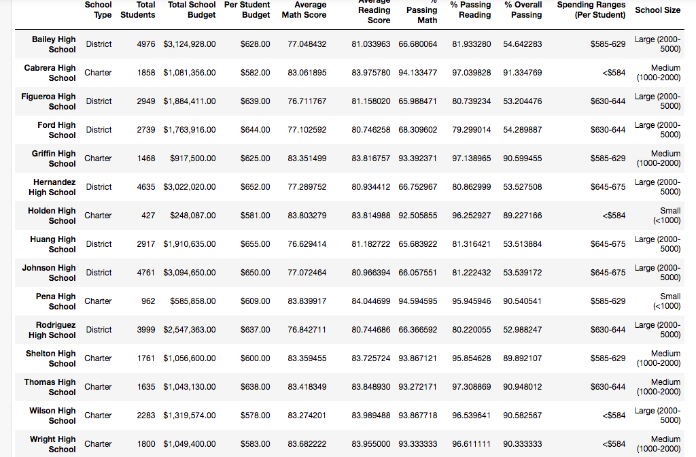
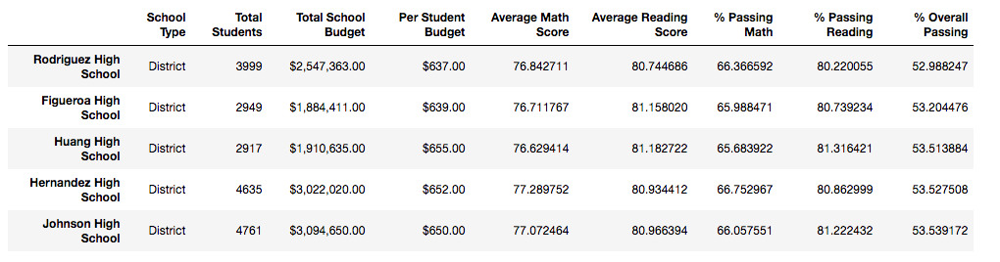
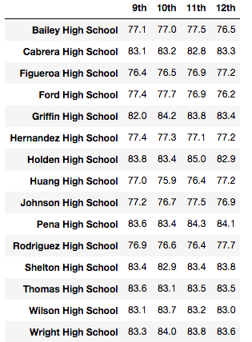
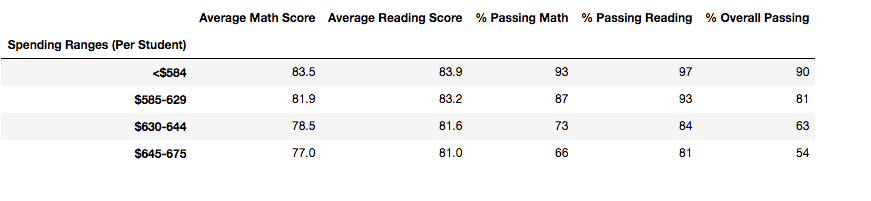
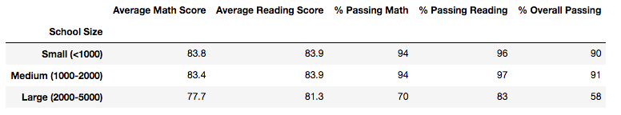
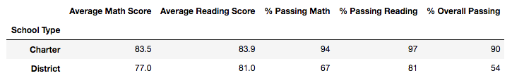

# School District Analysis

## Overview 

The following is an analysis of a school district's standardized test scores to provide insights into performance trends and patterns in relation to school spending, school size, and school type. After scores belonging to the Thomas High School ninth grade were found to show evidence of academic dishonesty, the analysis was undertaken a second time with those scores affected being voided. The differences between the original analysis and the second excluding ninth grade scores from Thomas High School are discussed below. 

## Results

* On a district level, the ommision of Thomas High nineth grade scores lowers four of the five standardized testing performance measures with exception being the average reading score, which stayed roughly the same. However, the other four performance categories dropped only slightly: 0.1 point for the average math score and 0.1 - 0.3% for the percentage of students passing math, reading, and both.  This may be seen as support for the claim that the scores were artificially high.
  ##### Original District Summary
  
  ##### Revised District Summary
  

* How is the school summary affected?

How does replacing the ninth graders’ math and reading scores affect Thomas High School’s performance relative to the other schools?

 

 

How does replacing the ninth-grade scores affect the following:
Math and reading scores by grade
 

Scores by school spending
 

Scores by school size
 

Scores by school type
 

## Summary:
Summarize four major changes in the updated school district analysis after reading and math scores for the ninth grade at Thomas High School have been replaced with NaNs.
